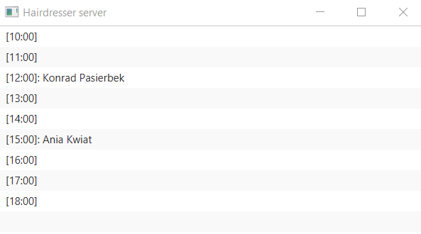

# Java-Tasks-and-Project
  I did some java tasks and small application for my studies
## Acquired Knowledge
  1) Differences between doing some operation in sequence and using threads
  2) I understand regex expressions
  3) Basics of sockets
  4) * My own implementation of binary tree
     * Difference between Comparator and Comparable
  5) Basic info about sniffer
  6) Get the handle of files and Caeser cipher
  7) I used sockets and javafx to create simple hairdresser application with synchronization
### Sample Images

